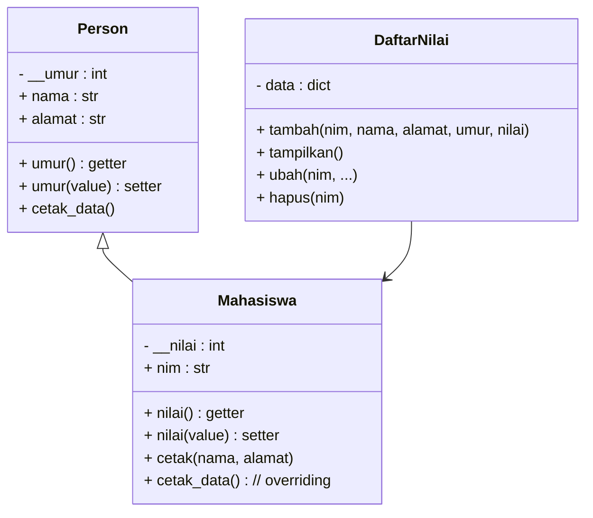

# README — Program Daftar Nilai Mahasiswa (OOP)

Program ini dibuat untuk memenuhi tugas praktikum dengan menerapkan konsep **Object-Oriented Programming (OOP)** menggunakan bahasa Python. Program mencakup fitur menambah, menampilkan, menghapus, dan mengubah data mahasiswa.

Dokumen ini berisi:

1. **Diagram Class (UML)**
2. **Flowchart Program**
3. **Penjelasan Program**

---

## 1. DIAGRAM CLASS (UML)

---

## 2. FLOWCHART PROGRAM

## 3. Penjelasan Program

### **a. Class Person**

Digunakan sebagai **parent class** yang menyimpan atribut dasar manusia:

* nama
* alamat
* umur (private + getter/setter)

Memiliki method:

* `cetak_data()` → menampilkan data dasar (akan dioverride di subclass)

### **b. Class Mahasiswa (Inheritance)**

Menurunkan class Person dan menambahkan atribut:

* nim
* nilai (private + getter/setter)

Memiliki:

* **overloading** pada method `cetak()` → menampilkan NIM saja, atau NIM + nama/alamat
* **overriding** method `cetak_data()` → menampilkan data lengkap mahasiswa

### **c. Class DaftarNilai**

Menjadi pengelola semua data mahasiswa menggunakan dictionary.

Fungsinya:

* `tambah()` → menambah objek Mahasiswa ke dictionary
* `tampilkan()` → menampilkan semua data mahasiswa
* `ubah()` → mengubah data berdasarkan NIM
* `hapus()` → menghapus data berdasarkan NIM

### **d. Alur Kerja Program**

1. Pengguna memilih menu (tambah, tampilkan, ubah, hapus, keluar).
2. Jika menambah → pengguna memasukkan data → disimpan ke dictionary.
3. Jika tampilkan → seluruh data mahasiswa ditampilkan menggunakan polymorphism.
4. Jika ubah → sistem mencari data berdasarkan NIM → memperbarui atribut.
5. Jika hapus → sistem menghapus data berdasarkan NIM.
